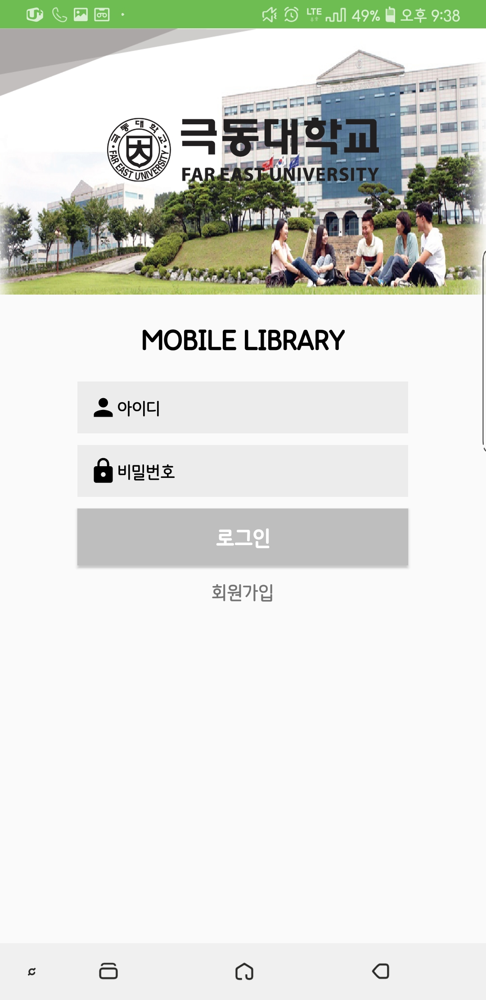

# KDU_Library
KDU_Library Project by KDH

**SERVER FTP** : [바로가기](https://ehgus83133.godohosting.com)

(가칭) 극동대학교 도서관

방학기간 동안 학교를 위해 내가 할 수 있는 일이 뭐가있을까 라는 생각을 하다가 자주가는 도서관에 있는 출입증시스템을 보고 기획하여 만든 안드로이드 앱입니다.
리눅스 웹호스팅서버를 구매, 호스팅서버의 phpMyadmin을 이용하여 SQL테이블을 구축하였습니다.
앱의 기능은 회원가입, 공지사항 게시판확인, QR코드 출입증, 도서관출입후 열람실자리예약 및 내자리 확인 기능이 있습니다.
안드로이드와 웹서버를 PHP를 통하여 연동하였고, 연동한 웹DB를 활용하여 로그인, 회원가입, 회원가입시 아이디 중복체크 기능을 구현하였으며, 극동대학교 도서관 웹페이지 공지사항 게시판를 파싱하여 웹서버에 저장후 다시 앱에서 불러와 간단하게 볼 수 있는 시스템을 구축하였습니다.
로그인 후에는 출입증과 같은 개념인 모바일 이용증을 만들었습니다. 모바일이용증은 회원가입시 입력한 학번, 이름, 학과 정보를 웹서버에서 불러와 현재시각을 합쳐 도서관출입시 출입증이될수있는 QR코드가 생성될수있도록 하였습니다.
또한 도서관의 자유열람실 좌석예약을 할 수 있는 시스템을 구축하였습니다.
자신이 원하는 좌석을 선택한후 예약을 하게되면 좌석정보가 저장됩니다.
그후 자신의 좌석을 확인할 수 있는 메뉴를 만들어 예약정보를 한눈에 쉽게 볼수있도록 만들었으며, 예약 연장기능을 만들어 자유로이 도서관을 이용할수있도록 하였습니다.

**스크린샷**
---

![loading]</img> </img>
로딩화면, 로그인 화면입니다.
